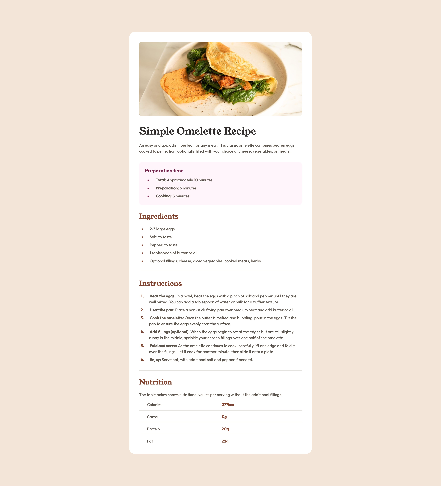

# Recipe Page

A responsive recipe page component built as part of the [Frontend Mentor](https://www.frontendmentor.io/challenges/recipe-page-KiTsR8QQKm) challenge.

## 🎯 Overview

This project showcases a clean, accessible design for displaying cooking recipes with preparation times, ingredients, instructions, and nutritional information.

### Solution



### Links

- Solution URL: [GitHub Repository](https://github.com/hakan-kemal/recipe-page)
- Live Site URL: [Netlify Deployment](https://recipe-page-hk.netlify.app/)

## 🛠 My Process

### Built With

- **HTML5** - Semantic markup
- **CSS3** - Modern styling techniques
  - CSS Custom Properties (CSS Variables)
  - CSS Nesting
  - Logical Properties (for RTL support)
  - Fluid Typography with `clamp()`
  - Flexbox Layout
- **Local Fonts** - [Young Serif](https://fonts.google.com/specimen/Young+Serif) & [Outfit](https://fonts.google.com/specimen/Outfit)

### What I Learned

This project reinforced several key concepts:

**Semantic HTML Structure:**
Implemented proper semantic sectioning to create a meaningful document outline for better accessibility and SEO:

```html
<article class="recipe-card">
  <header>
    <h1>Simple Omelette Recipe</h1>
    <p>Description...</p>
  </header>
  <section>
    <h2>Ingredients</h2>
    <!-- content -->
  </section>
</article>
```

**Fluid Typography:**
Used `clamp()` function to create responsive font sizes that scale smoothly between breakpoints:

```css
.recipe-title {
  font-size: clamp(2.25rem, 2.0115rem + 1.0178vw, 2.5rem);
}
```

**Accessible Tables:**
Structured nutrition table with proper semantic elements and visually-hidden headers for screen readers:

```html
<table>
  <thead class="visually-hidden">
    <tr>
      <th scope="col">Nutrient</th>
      <th scope="col">Amount</th>
    </tr>
  </thead>
  <tbody>
    <!-- data rows -->
  </tbody>
</table>
```

### Continued Development

Areas I want to focus on in future projects:

- Container queries for more modular component design
- Advanced CSS Grid layouts
- Print stylesheet optimization for recipes
- Progressive enhancement techniques

### Useful Resources

- [MDN Web Docs - clamp()](https://developer.mozilla.org/en-US/docs/Web/CSS/clamp) - Understanding fluid typography
- [web.dev - CSS Nesting](https://web.dev/learn/css/nesting) - Native CSS nesting guide
- [CSS-Tricks - Logical Properties](https://css-tricks.com/css-logical-properties-and-values/) - Comprehensive guide on logical properties for internationalization

## 👤 Author

- Frontend Mentor - [@hakan-kemal](https://www.frontendmentor.io/profile/hakan-kemal)
- GitHub - [@hakan-kemal](https://github.com/hakan-kemal)

## 🙏 Acknowledgments

Thanks to Frontend Mentor for providing this challenge and the design specifications.
